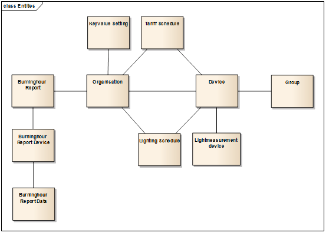

## Models and Views

### Design view

The image below shows a high-level view of the system's components.

### Data model of a (not open source) smart lighting web application 

_Image showing the datamodel for the owners and management application_

Data model explanation:

| **Table** | **Description** |
| --- | --- |
| devices | Devices tabel |
| organizations | Organization table with userinfo. |
| lightmeasurementdevices | Light measurement table for linking to devices and conversion to transitions (via sms\_type and sms\_index) of incoming light measurement texts. |
| groups | Device groups. Device can exist only in 0 or 1 group. |
| Lighting schedule | Available lighting schedules linked to device (after upload of schedule). |
| Tariff schedule | Available tariff schedules linked to device (after upload of schedule). |
| Keyvalue settings | Key/value pairing to store dynamic configuration. Organisations have their own configuration. |
| Burninghour reports | Monthly Burninghour reports |
| Burninghour report devices | Device informatie burninghour report |
| Burninghour report data | Data related to a device in burninghour report. |

### Logical view

The logical view is a high-level overview of the system. The image below displays the main components and interfaces between these components.

 

### Technology selection

Open LDAP is not applied. A database solution was chosen instead of Directory services for authorisation.
